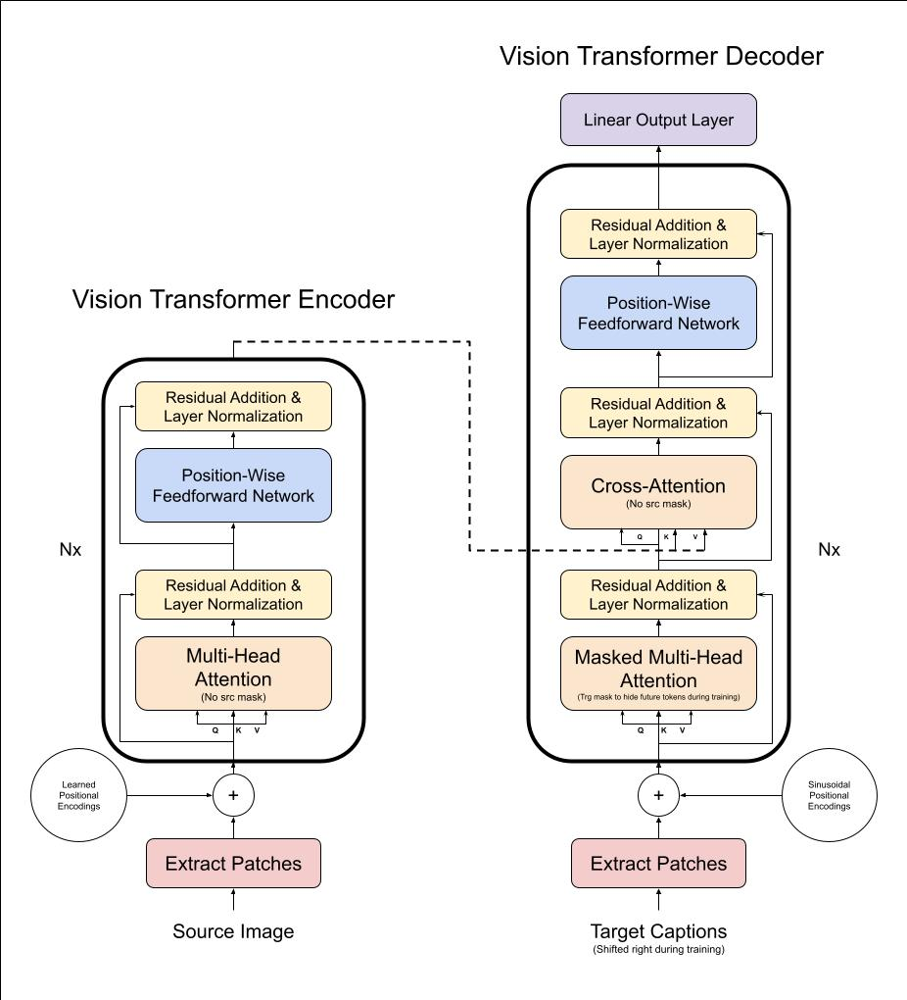

# image-captioning-model

This is an image captioning model that I built in PyTorch. It uses a Vision Transformer encoder and Transformer decoder. See the model architecture and code for more details. The model takes in an image, and returns a description of the image.

